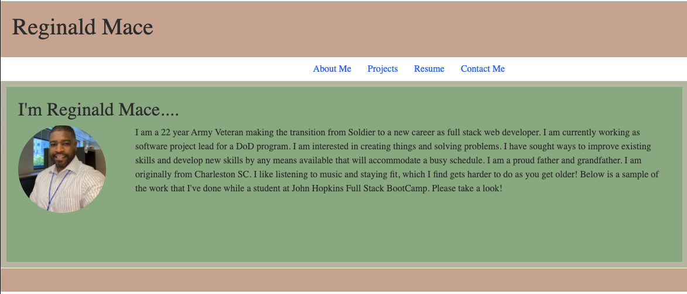

# react-portfolio

## Description

Portfolio of web technologies that I have used to create applications

## License

This application is license through MIT. You can find more out more about the license at : .

## Questions:

For any questions about this application please contact me github: https://github.com/reggiemace
Additional questions can be sent to mailto:reginaldmace36@gmail.com.
